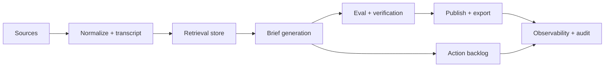

# design: bootstrap

## Target architecture

## Monorepo shape

- `apps/web`: multi-tenant admin, reader, review, and Ask my briefs.
- `apps/mobile`: voice-note ingest, reader, review, action follow-up.
- `apps/extension`: save source, annotate, send to workspace.
- `apps/mcp-server`: controlled programmatic access to briefs, sources, and
  actions.
- `packages/db`: schema, migrations, tenant scoping, pgvector helpers.
- `packages/sources`: connector contracts and fixtures.
- `packages/pipeline`: canonical item and brief pipeline types.
- `packages/retrieval`: hybrid retrieval, rerank, citation packing.
- `packages/evals`: eval datasets, graders, reports, thresholds.
- `packages/integrations`: publish/sync targets.
- `packages/observability`: OpenTelemetry, Sentry/PostHog adapters, run logs.
- `inngest/`: source polling, transcription, brief jobs, eval jobs, publishing.

## Release ladder

1. Local fixtures.
2. Preview workspace with seed sources.
3. Shadow mode against real feeds with no publishing.
4. Reviewer-approved publishing.
5. Scheduled publishing with rollback.

## Anti-slop controls

- No connector without fixtures.
- No LLM output without evals.
- No background job without replay/idempotency proof.
- No publish path without unpublish/rollback.
- No multi-tenant data access without tenant-scoped tests.

