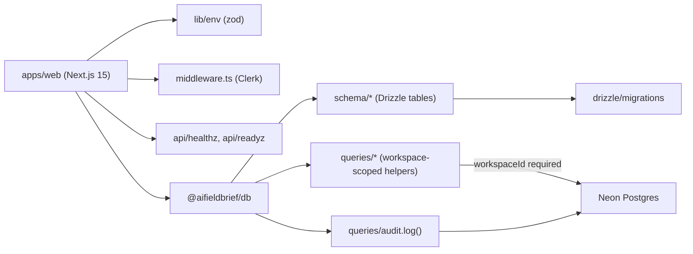

# design: foundation

## Shape



## Packages

### `packages/db`

- `src/env.ts` — zod schema for `DATABASE_URL` (pooled, for runtime) and
  `DIRECT_DATABASE_URL` (unpooled, for migrations). Import-time validation;
  missing keys throw before any query runs.
- `src/client.ts` — `@neondatabase/serverless` HTTP driver plus Drizzle.
  A serverless-friendly client; the same module re-exports a node-postgres
  client wrapper for tests and migrations.
- `src/schema/identity.ts` — `users`, `orgs`, `org_members`.
- `src/schema/workspaces.ts` — `workspaces`, `workspace_members`,
  `workspace_invites`.
- `src/schema/audit.ts` — `audit_events`.
- `src/schema/api_keys.ts` — `workspace_api_keys`.
- `src/queries/workspaces.ts` — `getWorkspaceById`, `listMembers`,
  `createInvite`, `acceptInvite`. Each function's first positional argument
  is `workspaceId: string`. The function body runs `assertWorkspaceId(...)`
  before any query.
- `src/queries/audit.ts` — `log(input: AuditLogInput)` writes an
  `audit_events` row.
- `src/test/tenant-scoping.test.ts` — vitest cases that pass `undefined`
  and `""` into helpers and assert each throws.

### `apps/web`

- Next.js 15.x with App Router, React 19, TypeScript strict.
- `src/lib/env.ts` — zod schema for `DATABASE_URL`,
  `NEXT_PUBLIC_CLERK_PUBLISHABLE_KEY`, `CLERK_SECRET_KEY`. Throws at module
  load if a key is missing.
- `src/lib/db.ts` — re-export from `@aifieldbrief/db`.
- `src/app/layout.tsx` — `<ClerkProvider>` shell + global CSS.
- `src/app/page.tsx` — server component with a 5-line scaffold message.
- `src/app/api/healthz/route.ts` — `{ ok: true }`.
- `src/app/api/readyz/route.ts` — `{ ok, db: 'ok'|'down' }`; on db error
  returns `{ ok: false, db: 'down' }`.
- `src/middleware.ts` — Clerk `clerkMiddleware` with `/`, `/api/healthz`,
  `/api/readyz` as public routes.

## Tenant-scoping rule

Every query helper signature has the form:

```ts
function helper(workspaceId: string, ...rest): Promise<T> {
  assertWorkspaceId(workspaceId);
  // ... drizzle query that filters on workspace_id ...
}
```

`assertWorkspaceId` throws `TenantScopeError` if the value is missing or
blank. Calling without the argument is a TypeScript error; calling with
`undefined` cast to string is the runtime guard. Both layers run.

## Out of scope here

- pgvector + embedding tables — spec 0005.
- Stripe billing tables and webhook — spec 0011.
- Inngest workflow tables — spec 0003.
- Source registry tables — spec 0002. The seed registry under
  `sources/registry.yaml` already lands; the runtime `sources` table
  arrives with spec 0002.
- Real Clerk wiring — the middleware and provider land here so the wiring
  is ready; live keys arrive when the user provides them.
