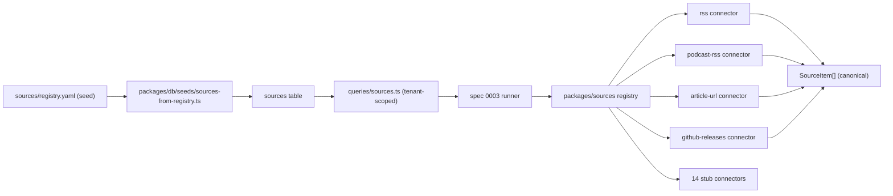

# design: source registry + ingestion

## Shape



## Connector contract

```ts
interface Connector<TConfig = unknown> {
  readonly sourceType: SourceType;
  readonly version: string;
  fetch(ctx: FetchCtx<TConfig>): Promise<SourceItem[]>;
}

interface FetchCtx<TConfig> {
  readonly workspaceId: string;
  readonly sourceId: string;
  readonly config: TConfig;
  readonly lastCursor?: string | null;
  readonly now: Date;
  readonly raw: ConnectorInput;
}
```

`ConnectorInput` is a discriminated union: connectors that parse feeds take
`{ kind: "bytes"; text: string }`; the article connector takes
`{ kind: "html"; html: string; url: string }`; the github-releases
connector takes `{ kind: "releases"; releases: GhReleaseLike[] }`.

This keeps connectors pure: zero network I/O lives in `packages/sources`.
The runner in spec 0003 owns HTTP, ETag handling, rate-limit checks,
backoff, and persists `SourceItem[]` to the database.

## Per-source-type registration

`packages/sources/src/registry.ts` is a module-scoped Map. Each connector
file imports the registry and calls `registerConnector(connector)` at
module load. The stubs file does the same for the 14 unimplemented types.
Importing `@aifieldbrief/sources` once wires every connector.

The registry rejects duplicate registrations: registering the same
`sourceType` twice throws. Tests that swap a stub for a real impl do so by
running impls first and skipping the matching stub.

## Dedupe strategy

Three keys land on each `SourceItem`:

- `canonical_url` — URL canonicalization (strip utm_*, lowercase host,
  trim trailing slash, drop fragment, sort query keys).
- `content_hash` — SHA-256 over `title + "\n" + canonical_url + "\n" +
  body`. Stable across runs.
- `provenance.fetcher` — `<connector>@<VERSION>`. Same input + same
  connector version reproduces the same item.

The runner in spec 0003 uses `(workspace_id, canonical_url, content_hash)`
as the upsert key. Different bodies on the same URL produce different
`content_hash` values and land as fresh items; the included-rate scoring
in spec 0006 catches repeat content.

## Retry + rate-limit shape

`FetchCtx.raw` carries the bytes the runner already pulled. If the runner
hit a 429, it retries before calling the connector; the connector never
sees a failed input. The connector documents its expected rate-limit
posture in a `provenance.rate_limit` shape (free-form per-connector),
which the runner persists.

## Sources table

```sql
sources (
  id uuid pk,
  workspace_id uuid not null references workspaces(id) on delete cascade,
  name text not null,
  type text not null,
  lane text not null,
  url text not null,
  cadence text not null,
  intake text not null,
  status text not null,
  signal integer,
  actionability integer,
  credibility integer,
  priority text,
  last_reviewed date,
  reliability_score numeric,
  custom_keywords jsonb default '[]',
  integration_config jsonb default '{}',
  notes text,
  created_at timestamptz not null default now(),
  deleted_at timestamptz
);
create index sources_workspace_status_lane_idx
  on sources(workspace_id, status, lane);

source_reliability_history (
  id uuid pk,
  source_id uuid not null references sources(id) on delete cascade,
  week_of date not null,
  included_rate numeric,
  avg_priority numeric,
  total_items integer,
  snapshot_at timestamptz not null default now()
);
```

`type` stays a `text` column rather than a Postgres enum: the
`SourceType` union changes faster than enum migrations are worth.
Validation runs at the application layer in `createSource`.

## Static source ops queue

`packages/sources/src/ops.ts` is the first operator queue boundary for
sources. It reads the local `sources/registry.yaml`, maps each registry
label to a canonical `SourceType`, inspects the already-registered
connector metadata, and returns rows for `/ops/sources`.

The queue is static by design: it checks registry freshness from
`last_reviewed` plus `review_frequency`, and connector readiness from
registered connector versions. It does not fetch source URLs, inspect
provider dashboards, or compute reliability from ingested items. Those
paths stay in the later runner and reliability specs.

## Frontier scout lane

`frontier-scout` is a separate registry lane for lesser-known repos,
startups, projects, talks, podcasts, videos, and changelogs that may
matter before mainstream AI coverage catches up. The lane is not a
quality exception. It adds a stricter routing rule: each promoted item
needs a verified source, a concrete mechanism, an action surface, a
30-90 minute test, a proof metric, and a kill criterion.

Three optional lenses support the lane:

- `source_arbitrage` decides whether the source is early signal or
  noise.
- `repo_project_scan` extracts shipped behavior, proof surface,
  integration target, and risk.
- `action_packet` converts the item into a bounded change with rollback
  and kill criterion.

The weekly brief renders two new surfaces from this lane. Action packets
are small tests ready to run before the next brief. Scout radar holds
promising items that need one more proof point or clearer adoption path.
Items with no concrete mechanism still go to Archive notes.

## Out of scope here

- HTTP fetch + caching layer (spec 0003 runner).
- Per-workspace cron (spec 0003).
- OAuth-gated connectors (spec 0010).
- Source registry CRUD UI (`apps/web/app/sources/`) — punt to the spec
  0002 follow-up.
- Reliability score computation (spec 0003 + 0006).
