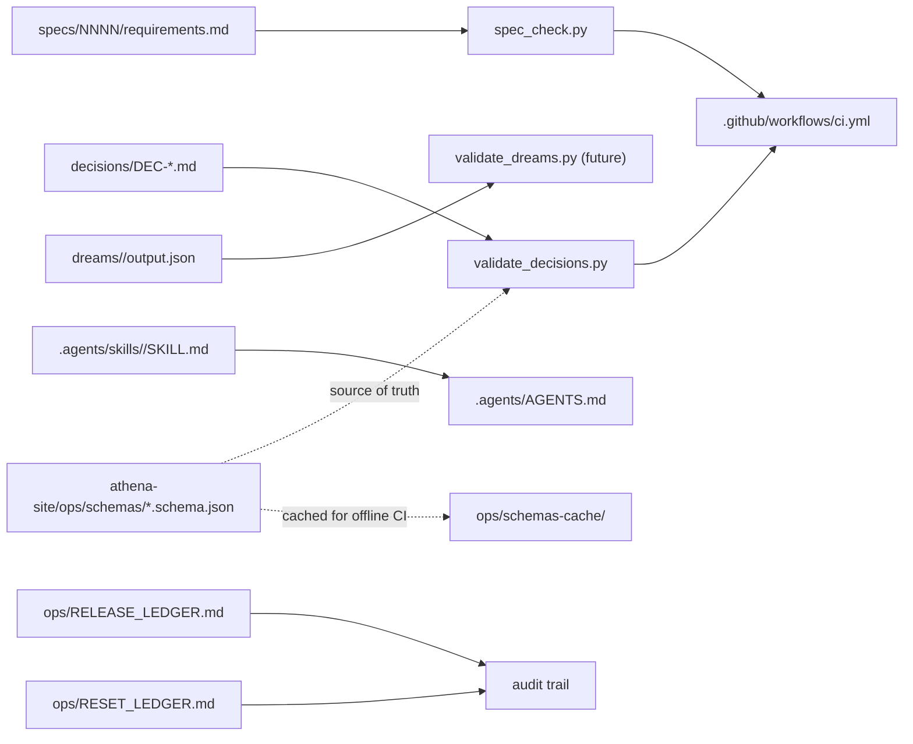

# design: cognitive-delivery-control-plane

## Shape

## Folders

### `specs/0010-cognitive-delivery-control-plane/`

The six-file ledger (`requirements`, `design`, `tasks`, `acceptance`,
`research`, `traceability`). Defines R-CDCP-001..010.

### `decisions/`

One markdown file per architectural choice. YAML front-matter holds the
structured fields the schema requires (`id`, `spec`, `requirement`,
`date`, `status`, `reversible`); body holds the narrative sections
`## decision`, `## alternatives`, `## rationale`, `## evidence`,
`## rollback`.

A backfill DEC documents an existing choice from a prior commit. A
fresh DEC lands in the same commit as the requirement it resolves.

### `dreams/`

One folder per week (`dreams/YYYY-WNN/`) once the weekly dream job
ships. The folder holds a human-readable `report.md` and a structured
`output.json` matching the cross-repo `dream-output.schema.json`. The
README documents the eight modes.

### `.agents/`

The single agent contract `AGENTS.md` plus skill packages under
`skills/<id>/SKILL.md`. A skill is markdown instructions plus optional
scripts and evals.

### `ops/`

The two ledgers (`RELEASE_LEDGER.md`, `RESET_LEDGER.md`) plus a
`schemas-cache/` folder that mirrors the athena-site contracts so CI
runs offline.

### `control-plane/workflows/`

Declarative YAML workflows that name the steps a single change moves
through (intake, spec, architecture, implementation, code-review,
tests, proof-gates, human-approval, release). Mirrors the codex
pattern; the YAML is documentation, not execution code.

## Scripts

### `scripts/validate_decisions.py`

1. Walks `decisions/DEC-*.md`.
2. Parses YAML front-matter from each file.
3. Loads `decision.schema.json` from the network URL with a local
   cache fallback under `ops/schemas-cache/`.
4. Validates each parsed front-matter against the schema.
5. Reports violations and exits 1; exits 0 on a clean walk.

### `scripts/spec_check.py` extension

Adds a new rule: every R-* defined in requirements.md must be named by
the front-matter `requirement:` field of at least one
`decisions/DEC-*.md` file. An allowlist file
`decisions/.spec-check-allowlist.yaml` carries the legacy R-* IDs whose
backfill DECs land in a later pass.

R-CDCP-* IDs covered by `DEC-CDCP-001-install-cdcp-governance.md` count
as resolved through that single DEC.

## Cross-repo links

- `../athena-site/ops/control-plane.md` — the charter that names the
  contracts.
- `../athena-site/ops/schemas/decision.schema.json` — the contract for
  DEC files in this repo.
- `../athena-site/ops/schemas/skill.schema.json` — the contract for
  SKILL.md front-matter.
- `../athena-site/ops/schemas/dream-output.schema.json` — the contract
  for future dream outputs.

## Failure modes

- A new R-* lands without a DEC: `spec_check` fails the build.
- A DEC drifts out of schema shape: `validate_decisions` fails the
  build.
- The cross-repo schema is unreachable in CI: `validate_decisions`
  falls back to `ops/schemas-cache/decision.schema.json`.
- A dream output proposes auto-merge: the schema's
  `human_review_required` default of `true` keeps the patch human-gated.
