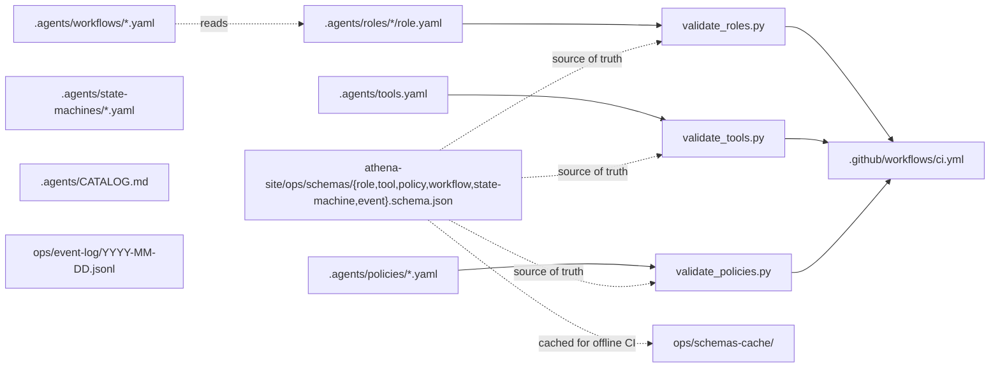

# design: cdcp-operating-model

## Shape

## Folders

### `.agents/roles/<id>/`

One folder per worked-example role. The folder holds five files:
`role.yaml` (the contract), `instructions.md` (the prose),
`tools.yaml` (the subset the role calls), `output.schema.json` (the
shape of the role's outputs), `gates.yaml` (the gates the role's run
must clear).

Six worked examples ship in this pass:

| Role | Guild | Mission |
|---|---|---|
| `control.coordinator` | control | routes a change from signal to release |
| `product.spec-writer` | product | turns intent into R-* specs with acceptance |
| `engineering.implementation` | engineering | writes the narrowest traceable code slice |
| `engineering.code-reviewer` | engineering | blocks merges on quality or security smells |
| `science.proof-gate-runner` | science | runs the gate suite; reports green or blocking |
| `learning.dream-orchestrator` | learning | weekly offline cognition; files candidates |

### `.agents/tools.yaml`

The tool registry. One YAML list with 16 seed entries. Each entry
matches the cross-repo `tool.schema.json` and names the role ids
permitted to invoke the tool.

### `.agents/policies/<id>.yaml`

The policy set. Five seed policies: a default-deny baseline at
priority 0, a coordinator-routing-only allow at priority 100, an
implementation-can-edit-code allow at priority 100, a
reviewer-cannot-edit-code deny at priority 200, and a
dream-candidates-require-human-approval rule at priority 100.

### `.agents/state-machines/<id>.yaml`

The artifact lifecycles. Three machines ship: `spec-lifecycle`
(draft → released → closed), `run-lifecycle` (running → done | failed
| cancelled), `release-lifecycle` (proposed → canary → monitoring →
stable | rolled_back).

### `.agents/workflows/<id>.yaml`

The step graphs. Three workflows ship: `single-change` (moved from
`control-plane/workflows/`), `weekly-dream` (Friday cron),
`incident-response` (incident signal).

### `.agents/CATALOG.md`

The 44-role TODO ledger. Each entry names the guild, the role id,
the one-line mission, and the status (`not-installed`).

### `ops/event-log/<date>.jsonl`

The append-only event ledger. One JSONL file per UTC day. Each line
is one event matching the cross-repo `event.schema.json`. The first
day-file carries the operating-model install event and the spec
creation event.

## Scripts

### `scripts/validate_roles.py`

1. Walks `.agents/roles/*/role.yaml`.
2. Parses each file as YAML.
3. Loads `role.schema.json` from the network URL with a local cache
   fallback under `ops/schemas-cache/`.
4. Validates each parsed object against the schema.
5. Confirms each role's `id` matches the parent directory name.
6. Reports violations and exits 1; exits 0 on a clean walk.

### `scripts/validate_tools.py`

1. Reads `.agents/tools.yaml` as a YAML list of tool entries.
2. Loads `tool.schema.json` from the network URL with a local cache
   fallback.
3. Validates each entry against the schema.
4. Reports duplicate ids and missing files; exits 0 on a clean walk.

### `scripts/validate_policies.py`

1. Walks `.agents/policies/*.yaml`.
2. Loads `policy.schema.json` from the network URL with a local
   cache fallback.
3. Validates each parsed object against the schema.
4. Confirms the policy set holds a default-deny baseline at priority
   0 that targets `roles: ["*"]` and `tools: ["*"]`.
5. Reports violations and exits 1; exits 0 on a clean walk.

### `scripts/spec_check.py` extension

Adds a rule: every R-* defined in any `requirements.md` should also
name an owner role from the catalog in the spec's `traceability.md`
via an `owner_role:` field on the requirement row. Existing R-* IDs
that pre-date this rule land on a new `roles_deferred:` list in
`decisions/.spec-check-allowlist.yaml`. R-CDCP-011..016 actually name
owner roles (the spec-writer drafts the traceability with the
`owner_role:` column) and do NOT land on the deferred list.

## Cross-repo links

- `../athena-site/ops/control-plane.md` — the charter that names the
  twelve guilds and the 50-role catalog shape.
- `../athena-site/ops/schemas/role.schema.json` — the contract for
  role.yaml.
- `../athena-site/ops/schemas/tool.schema.json` — the contract for
  tools.yaml entries.
- `../athena-site/ops/schemas/policy.schema.json` — the contract for
  policy files.
- `../athena-site/ops/schemas/workflow.schema.json` — the contract
  for workflow files.
- `../athena-site/ops/schemas/state-machine.schema.json` — the
  contract for state-machine files.
- `../athena-site/ops/schemas/event.schema.json` — the contract for
  event-log lines.

## Failure modes

- A role.yaml that drifts out of schema shape: `validate_roles` fails.
- A tool entry that names a role id not in `.agents/roles/`: a future
  validator pass catches this; today the gate trusts the registry
  author.
- A policy set without a default-deny baseline:
  `validate_policies` fails.
- A workflow step that references a role id absent from both
  `.agents/roles/` and `.agents/CATALOG.md`: today a manual read
  catches this; a future validator pass will enforce it.
- A second event with the same `event_id`: the schema's uuid format
  does not enforce uniqueness across lines; a future validator pass
  will.
